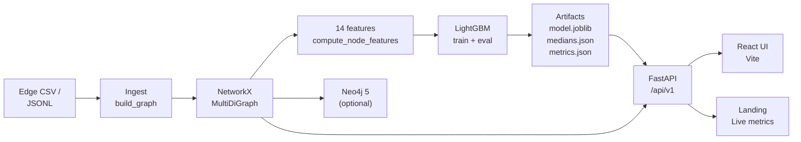

<div align="center">

[](https://github.com/stelioszach03/aml-graph-investigator/actions)

# Aegis · Graph AML Investigator

**Graph-native anti-money-laundering investigation platform with explainable LightGBM scoring, path-level reason codes, and a live React investigator console.**

[](https://www.python.org/)
[](https://fastapi.tiangolo.com/)
[](https://lightgbm.readthedocs.io/)
[](https://networkx.org/)
[](https://neo4j.com/)
[](https://react.dev/)
[](https://www.docker.com/)
[](LICENSE)

**[Landing](https://stelioszach.com/aml-graph-investigator/)**  ·  **[Investigator UI](https://stelioszach.com/aegis-graph-aml/)**  ·  **[API Health](https://stelioszach.com/aegis-graph-aml/api/v1/health)**  ·  **[API Docs](https://stelioszach.com/aegis-graph-aml/docs)**

</div>

---

## What it does

Aegis AML ingests a directed transaction graph, engineers **14 topology and flow features per node** (degree, PageRank, betweenness, triad motifs, ego density, txn amount sums, avg neighbor degree, clustering, hub/authority), trains a **LightGBM binary classifier**, and surfaces ranked suspects with **path-level explanations** and **what-if simulation**. Every alert is case-openable in a React investigator console with mini-graph view, neighborhood expansion, and local-surrogate explanation.

> Not a toy. The live deployment has **3 061 nodes and 51 758 edges**, a trained model with **ROC-AUC 0.87** / **PR-AUC 0.69** / **Brier 0.047**, and real-time scoring over the full population.

## Highlights

- **End-to-end graph ML pipeline** — one `make ingest` + `make train` and the model is shipped, metrics are persisted to SQLite, and artifacts land in `models/baseline/`.
- **14 hand-engineered topology features** — pure NetworkX, zero external graph ML library, so every signal is auditable.
- **LightGBM with honest evaluation** — stratified train/val split, ROC-AUC / PR-AUC / Brier / precision@K, feature importances reported as raw gains.
- **Explainable scoring** — local surrogate contributions + k-shortest-path rationales + ego-graph summarization per case.
- **What-if simulator** — analysts can add or remove edges on a 2-hop ego subgraph and see the recomputed score delta in milliseconds.
- **Neo4j integration** — optional push of the edge list to Neo4j 5 for Cypher-native exploration alongside the API.
- **Two frontends**:
  - **React + Vite investigator console** (`/`) — score table, case explorer, graph mini-view, header token auth.
  - **Editorial landing page** (`/aml-graph-investigator/`) — live metrics, animated ring graph, feature importance bars.
- **Full test suite** — pytest unit tests for features, API, and explanations.

## Architecture



## The 14 Features

| # | Feature | Type | Description |
|---|---------|------|-------------|
| 1 | `degree_in` | Topology | In-degree |
| 2 | `degree_out` | Topology | Out-degree |
| 3 | `txn_cnt_in` | Flow | Incoming transaction count |
| 4 | `txn_cnt_out` | Flow | Outgoing transaction count |
| 5 | `txn_amt_sum_in` | Flow | Incoming amount sum |
| 6 | `txn_amt_sum_out` | Flow | Outgoing amount sum |
| 7 | `pagerank` | Topology | PageRank centrality |
| 8 | `betweenness` | Topology | Betweenness centrality |
| 9 | `clustering` | Topology | Local clustering coefficient |
| 10 | `avg_neighbor_degree` | Topology | Average neighbor degree |
| 11 | `ego_density` | Topology | 1-hop ego subgraph density |
| 12 | `triad_motifs` | Topology | Triad motif count |
| 13 | `hub_score` | Topology | HITS hub score |
| 14 | `authority_score` | Topology | HITS authority score |

## Live Model Quality

Reported on the current deployment after `/train` on the full graph:

| Metric | Value |
|--------|------:|
| ROC-AUC | **0.8716** |
| PR-AUC | **0.6936** |
| Brier Score | **0.0470** |
| Precision @ 100 | **0.200** |
| Precision @ 500 | 0.0817 |
| Precision @ 1000 | 0.0817 |

Top-5 feature importances (LightGBM gain):

1. `txn_cnt_out` — 14 414
2. `degree_out` — 6 729
3. `avg_neighbor_degree` — 4 578
4. `txn_amt_sum_out` — 4 005
5. `betweenness` — 3 405

## API

### Endpoints

| Method | Path | Description |
|--------|------|-------------|
| `GET` | `/api/v1/health` | Liveness + graph summary |
| `GET` | `/api/v1/auth/status` | Whether bearer auth is enabled |
| `GET` | `/api/v1/neo4j/health` | Neo4j driver status |
| `POST` | `/api/v1/ingest` | Load edges CSV + build features |
| `POST` | `/api/v1/train` | Train LightGBM + persist artifacts |
| `GET` | `/api/v1/metrics/last` | Last trained model's metrics |
| `POST` | `/api/v1/score` | Score all nodes, return top-K |
| `GET` | `/api/v1/case/{node_id}` | Score + neighbors + ego features |
| `GET` | `/api/v1/explain/{node_id}` | Local surrogate + k-shortest paths |
| `POST` | `/api/v1/what-if` | Simulate edge add/remove, recompute score |

### Example

```bash
curl -s -X POST https://stelioszach.com/aegis-graph-aml/api/v1/score \
  -H 'Content-Type: application/json' \
  -d '{"topk": 5}' | jq
```

```json
{
  "topK": [
    {"node_id": "A1415", "score": 0.999999981},
    {"node_id": "A2642", "score": 0.999999967},
    {"node_id": "A1844", "score": 0.999999962},
    {"node_id": "A594",  "score": 0.999999955},
    {"node_id": "A1886", "score": 0.999999945}
  ],
  "count": 3061,
  "constant_scores": false
}
```

## Quickstart

### Docker (recommended)

```bash
git clone https://github.com/stelioszach03/aegis-graph-aml.git
cd aegis-graph-aml
cp .env.example .env

docker compose -f docker-compose.vps.yml up -d --build
```

Services:

- **React UI**: http://localhost:18730
- **FastAPI**: http://localhost:18300/docs
- **Neo4j Browser**: http://localhost:7474 (user `neo4j` / pass `testtest`)

### Local (venv)

```bash
python3 -m venv .venv
source .venv/bin/activate
pip install -r requirements.txt

# Ingest synthetic data + train + score
python scripts/generate_synth.py
python scripts/ingest_demo.py
python scripts/score_demo.py

# Serve the API
uvicorn app.main:app --host 0.0.0.0 --port 8000 --reload

# Serve the UI (separate terminal)
cd ui/web && npm install && npm run dev
```

## Project Layout

```text
app/
├── main.py                 FastAPI app + CORS + UI mount
├── api/
│   └── v1.py               All /api/v1 endpoints (ingest, train, score, case, explain, what-if)
├── core/                   config, json logging
├── graph/
│   ├── builder.py          Edge loader + NetworkX builder + Neo4j push
│   ├── features.py         14 node features + parquet persistence
│   └── explain.py          k-shortest paths + local surrogate + case summarizer
├── ml/
│   ├── train_lgbm.py       LightGBM trainer + artifact persistence
│   ├── predict.py          Model load + feature alignment + batch scoring
│   ├── dataset.py          Stratified splits
│   └── gnn_optional.py     Reserved for GNN upgrade path
└── storage/
    ├── sqlite.py           Async SQLite init + metric-run CRUD
    └── models.py           ORM models

ui/web/
├── src/
│   ├── App.tsx             Investigator layout
│   ├── components/
│   │   ├── ScoreTable.tsx
│   │   ├── CaseExplorer.tsx
│   │   ├── GraphMiniView.tsx
│   │   ├── MetricsCard.tsx
│   │   └── HeaderToken.tsx
│   └── lib/api.ts          Typed client with auth-token support
└── vite.config.ts          Base-path aware for subpath deployment

scripts/                    Demo generators, smoke tests, reset utilities
tests/                      pytest: features, API, explanations
docker/                     Dockerfile.api, Dockerfile.ui
models/baseline/            Trained artifacts (joblib, json)
data/                       raw/ (synth_edges.csv), interim/ (graph.pkl), processed/ (labels.csv, labels_all.csv)
```

## Configuration

`.env` keys:

| Variable | Purpose |
|----------|---------|
| `APP_NAME` | Display name |
| `APP_VERSION` | Reported in `/api/v1/health` |
| `DATA_DIR` | Root for data inputs/outputs |
| `MODEL_DIR` | Trained artifact directory |
| `SQLITE_URL` | Async SQLite DSN for metric runs |
| `NEO4J_URI` / `NEO4J_USER` / `NEO4J_PASS` | Optional Neo4j |
| `API_AUTH_TOKEN` | Simple bearer token (empty = open) |
| `GRAPH_PAGE_RANK_ALPHA` | PageRank damping |
| `EXPLAIN_MAX_PATH_LEN` / `EXPLAIN_K_PATHS` | k-shortest path config |

## Testing

```bash
make setup
make test              # pytest unit tests
make smoke             # end-to-end: ingest → train → score → case → explain
```

## Roadmap

- [ ] Upgrade from LightGBM baseline to a GraphSAGE GNN with neighbor sampling
- [ ] Replace synthetic data with a real labeled AML dataset (Elliptic, IBM AML, Kaggle)
- [ ] Streaming ingest for event-time case surfacing
- [ ] Shadow-mode A/B against a rules baseline
- [ ] Persistent analyst audit log + signed decisions

---

<div align="center">

Built by **[Stelios Zacharioudakis](https://stelioszach.com)** · ML Engineer & Researcher · Athens → Toronto

[Portfolio](https://stelioszach.com) · [GitHub](https://github.com/stelioszach03) · [LinkedIn](https://www.linkedin.com/in/stylianos-georgios-zacharioudakis-47024428a)

</div>
