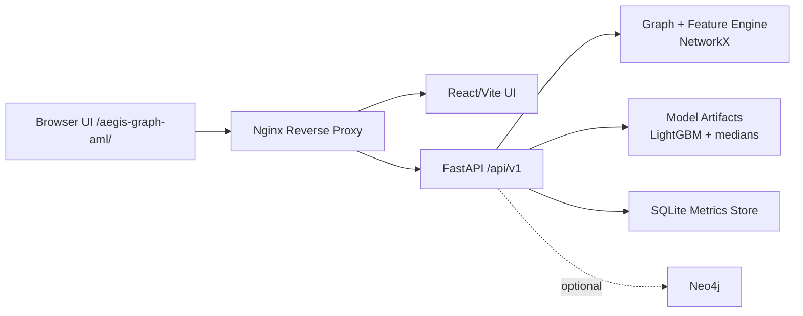

# AML Graph Investigator

Graph-native AML investigation stack with explainable scoring, case-oriented APIs, and deploy-ready observability.

## Live Demo
- UI: https://stelioszach.com/aegis-graph-aml/
- API health: https://stelioszach.com/aegis-graph-aml/api/v1/health
- API docs: https://stelioszach.com/aegis-graph-aml/docs

## Why This Project
- Detects suspicious graph behavior (rings, fan-out, high-risk hubs) missed by row-only models.
- Explains decisions with path rationale plus top contributing features.
- Runs end-to-end with Docker and ships with practical deployment profiles.

## Architecture


## Core Capabilities
- `ingest`: Loads edges, builds graph, computes robust node features, and auto-builds `labels_all.csv`.
- `train`: Trains LightGBM baseline and stores metrics plus feature medians.
- `score`: Returns ranked risky entities with stable response schema.
- `explain`: Provides reason string, path-level context, and top contributors.
- `what-if`: Simulates local/global feature perturbation and score deltas.
- UI includes metrics panel, precision controls, mid-range slice, and one-click demo bootstrap.

## Tech Stack
- Backend: FastAPI, NetworkX, LightGBM, Pandas
- UI: React + Vite
- Storage: SQLite (metrics/runs)
- Optional graph DB: Neo4j
- Ops: Docker Compose, pytest, smoke e2e scripts

## Quick Start (Docker)
Prerequisites:
- Docker + Docker Compose

Run locally:
```bash
make up
make demo-run
```

Open:
- UI: http://localhost:5173
- API health: http://localhost:8000/api/v1/health

## Auth Modes
Open mode:
```bash
make demo-open
```

Protected mode:
```bash
make demo-protected TOKEN=demo123
```

## API Examples
```bash
BASE=http://localhost:8000
TOKEN=""   # set if API_AUTH_TOKEN is enabled
AUTH=""
if [ -n "$TOKEN" ]; then AUTH="-H Authorization: Bearer $TOKEN"; fi

# Ingest
curl -sS -H "Content-Type: application/json" $AUTH \
  -d '{"path":"data/raw/synth_edges.csv","push_neo4j":false}' \
  "$BASE/api/v1/ingest"

# Train
curl -sS -H "Content-Type: application/json" $AUTH \
  -d '{"labels_path":"data/processed/labels_all.csv"}' \
  "$BASE/api/v1/train"

# Score
curl -sS -H "Content-Type: application/json" $AUTH \
  -d '{"topk":20}' \
  "$BASE/api/v1/score"

# Explain
curl -sS $AUTH "$BASE/api/v1/explain/A377"
```

## Deployment (VPS Subpath)
For production subpath deployment (`/aegis-graph-aml/`):
```bash
docker compose -f docker-compose.vps.yml build
docker compose -f docker-compose.vps.yml up -d
```

Important notes:
- UI is built with `VITE_BASE=/aegis-graph-aml/`.
- API base is `VITE_API_BASE=/aegis-graph-aml`.
- Keep API and UI proxy paths separated in Nginx:
  - `/aegis-graph-aml/api/` -> FastAPI
  - `/aegis-graph-aml/` -> UI
- Do not use generic `sub_filter` rewrites for `"/api/"` in UI bundle responses (can cause double-prefix paths).

## Testing
```bash
make docker-test
make e2e
```

Current baseline:
- `pytest`: 10 passed

## Troubleshooting
- `409 No features/model in cache`: run `ingest` then `train`, or click `Initialize demo` in UI.
- HTML returned instead of JSON: proxy routing is wrong (API path is hitting UI index).
- `401 Unauthorized`: set token in UI header or clear `API_AUTH_TOKEN` for open mode.
- Very similar top scores: use `Decimals: 6` and `Mid-range` to inspect score spread.

## Repository Layout
```text
app/                 FastAPI app, graph features, ML, storage
ui/web/              React/Vite frontend
scripts/             Data generation and smoke helpers
docker/              API/UI Dockerfiles
docker-compose*.yml  Local + VPS deployment profiles
tests/               API/feature/explain tests
```

## License
MIT
